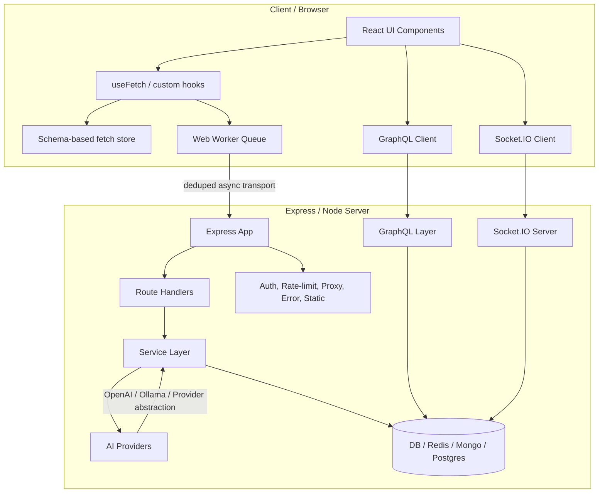
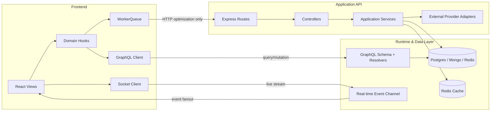

# System Architecture

## Purpose

This project started as a small hobby app and evolved into a multi-surface experimentation platform. The current architecture intentionally combines several patterns: REST, GraphQL, Web Workers, Socket.IO, schema-driven data orchestration, and AI integration. That flexibility is valuable for experimentation, but for long-term stability the system should evolve toward a clearer, layered architecture with strict ownership boundaries.

This document describes:

- the current architecture as implemented in the codebase
- the target architecture for a stable platform pattern
- the migration rules that keep experimentation without creating architectural drift

---

## 1. Architectural principles for the stable version

1. One source of truth per data domain
2. Clear separation between transport, orchestration, and domain logic
3. Worker-based fetching only for browser performance optimization, not as a second state system
4. GraphQL for app-domain data, REST for external/public APIs, Socket.IO for live events
5. AI integration through a provider abstraction and a typed service layer
6. Explicit boundaries for infra concerns: DB, cache, auth, proxy, static assets, and real-time transports

---

## 2. Current architecture snapshot

The codebase currently spans:

- Express server bootstrap and route composition in [server/src/app.ts](../../server/src/app.ts)
- process lifecycle and shutdown handling in [server/src/index.ts](../../server/src/index.ts)
- worker-based async orchestration in [src/workers/WorkerQueue.ts](../../src/workers/WorkerQueue.ts)
- schema-driven data hooks in [src/hooks/useFetch/index.ts](../../src/hooks/useFetch/index.ts)
- GraphQL client abstraction in [src/graphql/client/index.ts](../../src/graphql/client/index.ts)
- Socket.IO client in [src/Context/SocketProvider.tsx](../../src/Context/SocketProvider.tsx)
- AI route implementation in [server/src/routes/chat.ts](../../server/src/routes/chat.ts)

This gives the project a very rich feature surface, but it also means several systems are simultaneously acting as the data authority.

---

## 3. High-level diagram

---

## 4. Current-state architecture analysis

### 4.1 Frontend layer

The frontend is intentionally rich:

- data-fetch hooks abstract the transport layer
- schema-based state provides a Redux-lite workflow without boilerplate
- Web Workers isolate expensive browser work
- GraphQL client abstracts domain data operations
- Socket.IO enables real-time updates

This is a good development experience for exploration, but it leaves the frontend with multiple ways to fetch and persist state.

### 4.2 Backend layer

The server is composed as a platform bootstrap rather than a narrow app shell:

- REST routes
- GraphQL handler
- proxy middleware
- file upload support
- auth/optional auth
- webpack dev middleware
- static asset serving
- health checks and graceful shutdown

This is useful in a playground environment, but it becomes hard to reason about when the number of responsibilities increases.

### 4.3 Data flow pattern

The system currently behaves like this:

1. UI triggers fetch via hook or direct GraphQL request
2. Transport goes through worker, direct HTTP, Socket, or GraphQL layer
3. Domain state may be updated in custom store + reducers + GraphQL cache + runtime socket updates
4. UI re-renders from whichever source answered last

This creates a hidden risk: multiple layers may update the same data without an obvious ownership rule.

---

## 5. Target architecture for stability

### 5.1 Stable design goals

The stable version should keep the useful experimentation surface while enforcing a stricter operating model:

- GraphQL owns application-domain state
- REST owns integration/public APIs
- Socket.IO owns live event streams
- WorkerQueue owns browser transport optimization only
- AI integration lives behind a service/provider abstraction
- Each layer is value-oriented and not state-duplicating

### 5.2 Target diagram

---

## 6. Recommended layered ownership model

| Layer          | Ownership                      | Allowed responsibilities                              |
| -------------- | ------------------------------ | ----------------------------------------------------- |
| React UI       | view/state presentation        | rendering, user interaction, optimistic UI            |
| Domain hooks   | orchestration                  | query lifecycle, caching hints, polling, stale checks |
| WorkerQueue    | browser transport optimization | dedupe, timeout, retry, off-main-thread fetching      |
| GraphQL client | domain data access             | queries, mutations, subscriptions, cache invalidation |
| Socket client  | live events                    | realtime event subscriptions                          |
| Express routes | protocol boundary              | request validation, auth gating, response shaping     |
| Services       | business logic                 | orchestration, domain rules, infrastructure calls     |
| Providers      | external integrations          | AI, DB, payment, notification adapters                |
| Data stores    | persistence                    | read/write, transactions, caches                      |

The important rule is: no layer should mutate the same domain state in multiple ways without an explicit policy.

---

## 7. What should be retained from the current design

These are the pieces worth keeping:

- custom fetch hook abstraction
- worker offloading for expensive browser work
- schema-driven data orchestration for experimentation
- GraphQL subscription readiness
- service-oriented backend bootstrap
- graceful shutdown and health checks
- AI provider flexibility

The goal is not to remove capability; it is to normalize the operating model.

---

## 8. Migration plan to a stable architecture

### Phase 1: define canonical ownership

- Choose one state owner per domain
- Start by naming the “source of truth” for each feature
- Remove accidental duplicate fetch paths

### Phase 2: isolate providers

- Move AI calls behind provider interfaces
- Split OpenAI/Ollama into adapters
- Standardize response contracts

### Phase 3: refactor the server composition

- Break [server/src/app.ts](../../server/src/app.ts) into smaller bootstrap modules
- Route registration should be declarative and decoupled from middleware assembly

### Phase 4: enforce transport boundaries

- REST for external integrations
- GraphQL for app-domain logic
- WebSocket for events only
- Worker for transport optimization only

### Phase 5: add observability and contract checks

- request IDs
- structured logs
- latency metrics
- health probes
- API contract validation

---

## 9. Practical recommendation for this repo

This project should evolve from a feature playground into a stable “platform skeleton” with clear guardrails:

- keep the experimental tooling in place
- limit how many entry points can mutate state
- define explicit service boundaries
- use adapters for external systems
- keep a single, consistent runtime model for each domain

The final architecture should feel like a robust prototype platform, not a collection of experiments stitched together.
