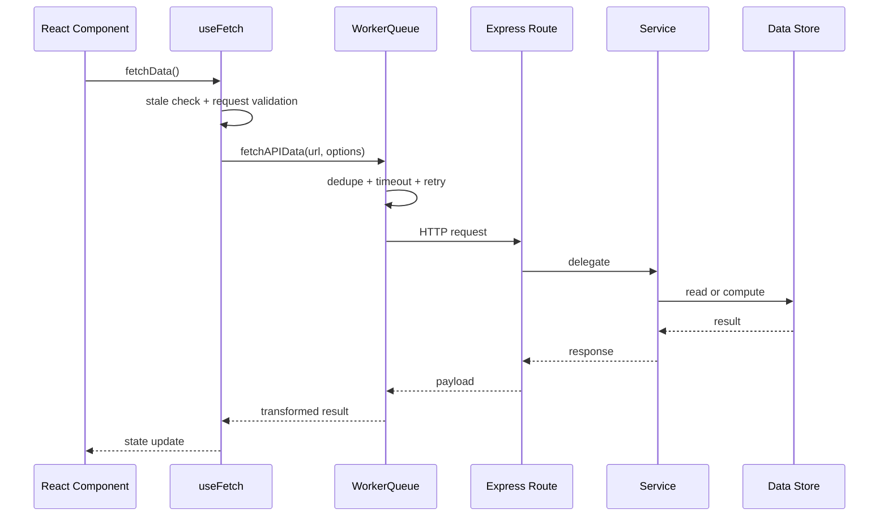
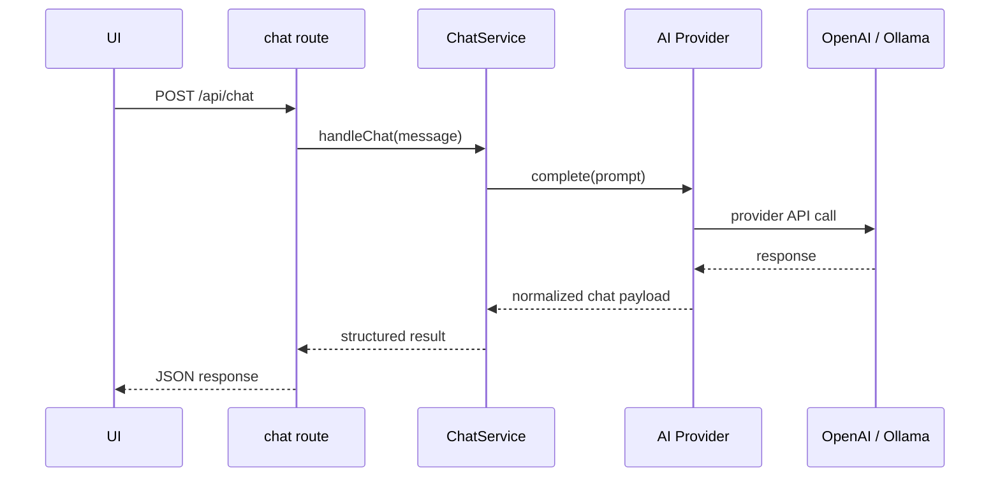
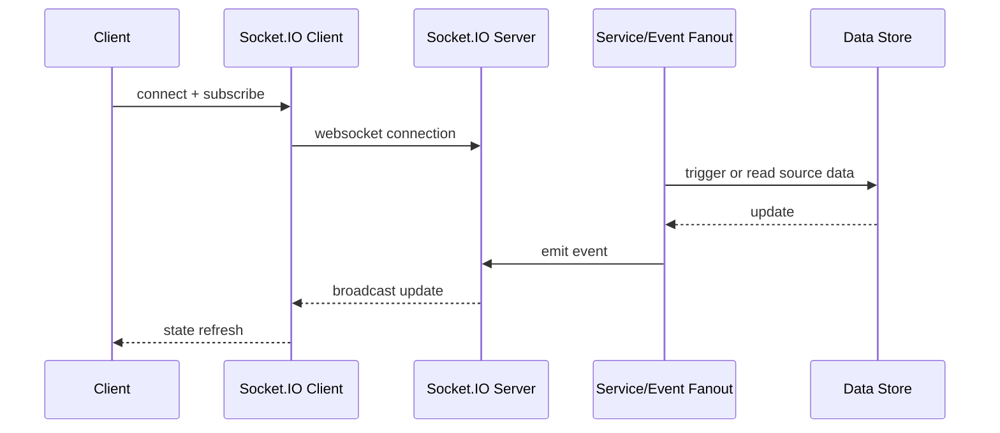

# Low-Level Design (LLD)

## 1. Objective

This document defines a stable low-level design for the current experimental architecture so it can evolve into a robust platform without losing the useful capabilities already in the repo. The design follows the existing implementation patterns in:

- [server/src/app.ts](../../server/src/app.ts)
- [server/src/index.ts](../../server/src/index.ts)
- [src/workers/WorkerQueue.ts](../../src/workers/WorkerQueue.ts)
- [src/hooks/useFetch/index.ts](../../src/hooks/useFetch/index.ts)
- [src/graphql/client/index.ts](../../src/graphql/client/index.ts)
- [server/src/routes/chat.ts](../../server/src/routes/chat.ts)

---

## 2. Design goals

- Clear boundaries between client-side runtime layers
- Stable data ownership per business domain
- Predictable server composition and route registration
- Retry, timeout, dedupe, and fallback behavior managed at the correct layer
- AI provider abstraction with typed contracts
- Observability via request IDs and structured logging
- Gradual migration without rewriting the whole project at once

---

## 3. Component responsibilities

### 3.1 Frontend runtime

#### React UI layer

Responsibilities:

- render component tree
- capture user actions
- call hook APIs
- render derived state

Rules:

- React components should not directly own network transport logic
- UI should consume domain hooks, not raw worker or GraphQL internals

#### Hook layer

Responsibilities:

- assemble fetch/update requests
- call worker or GraphQL transport
- apply stale checks, retries, and transform logic

Key implementation fit:

- [src/hooks/useFetch/index.ts](../../src/hooks/useFetch/index.ts)
- useFetch should remain the primary API for browser-side data fetch orchestration

#### WorkerQueue layer

Responsibilities:

- isolate network work off the main thread
- deduplicate identical requests
- handle worker fallback to the main thread if needed
- emit telemetry

Key implementation fit:

- [src/workers/WorkerQueue.ts](../../src/workers/WorkerQueue.ts)

Rules:

- this layer is a transport optimization layer only
- it should not become the app state owner

#### GraphQL Client layer

Responsibilities:

- query execution
- mutation execution
- optimistic mutation flow
- subscription lifecycle
- cache invalidation

Key implementation fit:

- [src/graphql/client/index.ts](../../src/graphql/client/index.ts)

Rules:

- GraphQL is for domain data and transactional flows
- GraphQL should not be a catch-all for every API interaction

#### Socket client layer

Responsibilities:

- live connection initialization
- subscription event handling
- reconnect logic
- room/channel management

Key implementation fit:

- [src/Context/SocketProvider.tsx](../../src/Context/SocketProvider.tsx)

Rules:

- Socket events are for real-time event distribution only
- domain updates must still be normalized into the chosen source-of-truth model

---

### 3.2 Server runtime

#### Express app bootstrap

Responsibilities:

- middleware assembly
- route registration
- config loading
- dev/prod environment behavior
- error pipeline

Key implementation fit:

- [server/src/app.ts](../../server/src/app.ts)

Rules:

- no business logic in app bootstrap
- bootstrap assembly should be declarative and clear

#### Route layer

Responsibilities:

- request validation
- auth/authorization checks
- input sanitization
- delegating to service methods
- response shaping

Key implementation fit:

- [server/src/routes/chat.ts](../../server/src/routes/chat.ts)

Rules:

- route handlers should be thin
- route files should not call external APIs directly unless acting as a strict adapter

#### Service layer

Responsibilities:

- orchestration logic
- business rules
- persistence/cache calls
- provider calls

Target patterns:

- ChatService
- UserService
- DataAccessService
- CacheService
- AuthService

#### Provider layer

Responsibilities:

- external integration contracts
- normalization of provider responses
- provider-specific errors and retry policy

Examples:

- AIProvider
- OpenAIProvider
- OllamaProvider
- DatabaseAdapter

#### Persistence layer

Responsibilities:

- DB connection lifecycle
- data access operations
- transaction boundaries
- health checks

Key implementation fit:

- [server/src/dbClients/PostgresDBConnection.ts](../../server/src/dbClients/PostgresDBConnection.ts)
- [server/src/dbClients/MongoDBConnection.ts](../../server/src/dbClients/MongoDBConnection.ts)
- [server/src/cachingClients/redis.ts](../../server/src/cachingClients/redis.ts)

---

## 4. Data ownership model

### Canonical rule

Each business domain must have exactly one source of truth.

#### Example ownership table

| Domain                     | Source of truth                           | Notes                                                     |
| -------------------------- | ----------------------------------------- | --------------------------------------------------------- |
| user profile               | GraphQL domain model or DB-backed service | avoid duplicate local cache writes                        |
| real-time stream events    | Socket event stream                       | ephemeral state, not persisted unless explicitly required |
| browser fetch optimization | WorkerQueue                               | transport optimization only                               |
| AI responses               | provider service contract                 | typed DTO normalized in service layer                     |
| UI-only transient state    | component local state                     | never shared globally                                     |

This rule is the key stabilization mechanism.

---

## 5. Detailed request flows

### 5.1 Browser fetch path



### 5.2 AI request path



### 5.3 Real-time event path



---

## 6. Interface contracts

### 6.1 AI provider interface

```ts
export interface AIProvider {
	name: 'openai' | 'ollama';
	complete(input: ChatPrompt): Promise<ChatResult>;
	healthCheck(): Promise<boolean>;
}
```

### 6.2 Chat service contract

```ts
export interface ChatService {
	sendMessage(message: string, context?: Record<string, unknown>): Promise<ChatResult>;
}
```

### 6.3 Standard request result model

```ts
export type RequestResult<T> =
	| { success: true; data: T; meta?: Record<string, unknown> }
	| { success: false; error: Error; meta?: Record<string, unknown> };
```

This makes route and hook code consistent and testable.

---

## 7. Low-level module layout

```text
src/
  hooks/
    useFetch/
    useSocketConnection/
  workers/
    WorkerQueue.ts
    MyWorker.worker.ts
  graphql/
    client/
    GraphQLCache.ts
  context/
    SocketProvider.tsx
  services/
    APIService.ts
  types/
    api.ts

server/
  src/
    app.ts
    index.ts
    routes/
      chat.ts
      authRoutes.ts
    services/
      chatService.ts
      authService.ts
    providers/
      aiProvider.ts
      openAIProvider.ts
      ollamaProvider.ts
    middlewares/
      authMiddleware.ts
      errorHandler.ts
    dbClients/
      PostgresDBConnection.ts
      MongoDBConnection.ts
    cachingClients/
      redis.ts
    socketConnection.ts
    globalErrorHandler.ts
```

---

## 8. Error handling and resilience

### Policy

- route-level validation errors: 4xx
- provider errors: normalized as domain-specific errors
- DB or infra errors: 5xx with structured logs
- worker failures: fallback to main-thread execution
- socket disconnects: reconnect with bounded retry

### Concrete requirements

- request correlation ID must flow from HTTP request to service logs
- retries should be bounded and explicit
- worker fallback should be transparent to callers
- AI provider failures should not leak raw provider error payloads into the UI

---

## 9. Observability design

Each request should carry:

- request ID
- operation type
- service name
- latency
- provider used
- status code / result

Logging should be centralized and structured, not scattered across ad hoc console statements.

Example:

```json
{
	"ts": "2026-08-30T12:00:00Z",
	"reqId": "4bafa9e8-7d95-4e4d-b0c2-7d5f7bd6b5aa",
	"route": "/api/chat",
	"provider": "ollama",
	"latencyMs": 412,
	"status": "success"
}
```

---

## 10. Migration strategy

### Step 1: stabilize boundaries

- define source-of-truth rules
- stop allowing direct state mutation from multiple layers

### Step 2: extract AI provider abstraction

- create provider interface
- move chat route logic into service + provider adapter

### Step 3: split route and app composition

- reduce the responsibilities in [server/src/app.ts](../../server/src/app.ts)
- register routes declaratively

### Step 4: normalize data contracts

- use a shared result model across REST and GraphQL operations
- convert provider responses to common domain DTOs

### Step 5: add architecture guardrails

- lint rules for service boundaries
- route/service separation checks
- lifecycle tests for worker fallback and socket reconnect behavior

---

## 11. Final target state

The project should evolve into a stable, layered system where:

- the UI remains flexible and exploratory
- the server is explicit and maintainable
- the data ownership model is clear
- AI, DB, cache, and real-time systems are isolated behind contracts
- worker transport optimization remains intact without turning into a state-management framework

This preserves the original spirit of the project while turning it into a system that is easier to extend safely.
